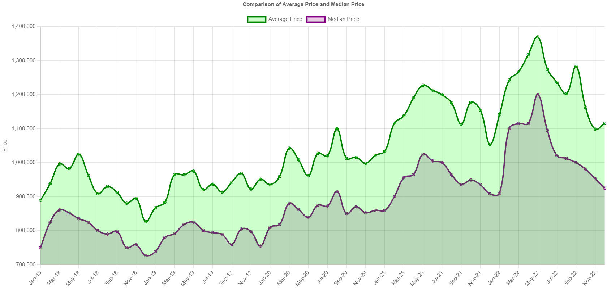
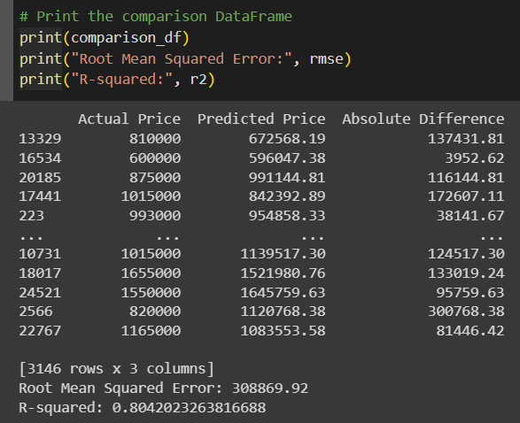
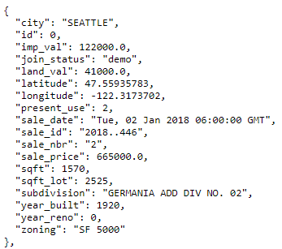
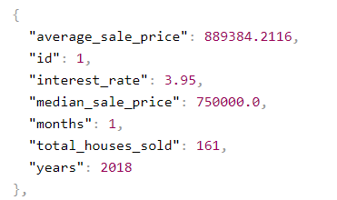

# Seattle Washington Housing Market
---
Group Project # 4 - Seattle Washington Housing Market with machine learning model

---
## 🏠 Table of Contents
- [Background](#background)
- [Process](#process)
- [Data Sources](#data)
- [Findings and Conclusions](#findings)
- [Part 1: Populate Database in pgAdmin](#part-1)
- [Part 2: Python Flask API ](#part-2)
- [Part 3: Dashboard Page](#part-3)
- [Part 4: ML modeling - multiple linear regression model](#part-4)
- [Part 5: Tableau Dashboard](#part-5) 

---
## 🏠 Background 

Welcome to the Seattle Washington Housing Market Analysis project, where we dive deep into the real estate dynamics of one of the Pacific Northwest's most exciting cities. This repository is dedicated to an in-depth exploration of the housing market trends spanning the years 2018 to 2022 in the bustling urban landscape of Seattle. Powered by the combined prowess of PostgreSQL and a Python Flask application, our project presents an interactive dashboard that offers an insightful overview of the housing market's evolution during this significant timeframe.

We completed a comprehensive analysis and a visualization dashboard using a Python Flask-powered API, HTML/CSS, JavaScript, and a SQL database plotly, leaflet, D3 and charts.js. This project seeks to provide valuable insights in understanding Seattle's real estate dynamics.

In addition to dissecting historical trends, we've developed a machine learning model aimed at forecasting housing prices in the Seattle area. Leveraging the power of Gradient Boosting Regressor algorithms, we've trained a robust predictive model that takes into account a multitude of factors affecting housing prices. By incorporating data on property attributes, location details, economic indicators, and more, our model serves as a powerful tool for prospective buyers, sellers, and investors looking to make informed decisions in the complex Seattle real estate landscape.

---
## 🏠 Process 

1. Understand the data and what we are trying to accomplish.
2. Clean data in CSV files using Excel and Jupyter Notebook.
3. Import data into a Database.
4. Create a flask app.
5. Process data using a Machine Learning Model.
6. Analyze the results and create visualizations.
7. Create a dashboard and presentation.

---
## 🏠 Data Sources 
Data for this dataset was pulled from a kaggle csv. All data collected and used in this analysis is intended for educational purposes only.

1. seattle_sales_all_data.csv ([From kaggle](https://www.kaggle.com/code/reidjohnson/house-price-eda-and-modeling-with-python/notebook))
2. seattle_sales.csv (cleaned up kaggle csv of only seattle from 2018-2022)
3. seattle_monthly_data.csv - (generated from kaggle dataset)
4. Zipcode Data (generated with geopy using lat/long from kaggle dataset)
5. Mortgage Interest Rates (https://fred.stlouisfed.org/series/MORTGAGE30US)

---
## 🏠 Findings and Conclusions 
The following findings and conclusions from the analysis are as follows:

The Seattle housing market, like many tech hubs, has seen a large increase in housing values in recent years. Our analysis focused on single family homes in the Seattle area from 2018 through 2022. All of the single family homes are definded by the zoning regulations within Seattle. Over the five year span the median home price for single family homes saw an increase of approximatley 31%. In dollars that represents an increase of a median home price of $800,000 in 2018 to a median price of $1,050,000 in 2022, which is an increase of $250,000. 

Using the data from the kaggle dataset we were able to create a machine learning model that predicts the price of a home based on the features of the home. The model was trained using the Gradient Boosting Regressor algorithm. The model was trained using 33 different features from our dataset. Some of those features included the following - living sqft , lot sqft, latitude, longitude, year built, total bed rooms, total bathrooms, water front, zipcode as well as several more factors. 

While training the model we went through several different regressions to generate the most accurate predictions we could. We found that we had the most accuracy by teaching the model with data from 2020-2022. The housing prices over this period displayed a more consistent increase in home prices over this period and generated a better fit or R^2 value from our model. Looking over the entire dataset from 2018-2022 the best R^2 value we were able to generate was approximatley 70%. By only analysing the data from 2020 - 2022 the model was able to generate an R^2 value of 80%.
 

---
## 🏠 Part 1: Populate Database in pgAdmin 
Deeper discription of the data can be found in the Resources kingcounty folder. See king_county_SQL_schema.sql.
1. king_county_sales: (this is the seattle sales data)
    - 24,950 lines of data
    - data collected from Jan-18 to Dec-22

2. monthly_seattle_sales:
    - 60 lines of data (monthly analysis)
    - data collected from Jan-18 to Dec-22

---
## 🏠 Part 2: Python Flask API  
The python Flask api was used to jsonify the databases:
1. seattle_sales.csv

2. seattle_monthly_data.csv

---
## 🏠 Part 3: Dashboard Page 

---
## 🏠 Part 4: ML modeling - multiple linear regression model 

### Performing Exploratory data analysis (EDA) and building a machine learning model for King County house data. 

## Background Information:
	
King county is a region in the state of Washington, USA, and it’s known for including the city of Seattle. EDA involves analyzing and summarizing the data to gain insights, while machine learning modeling involves creating predictive models using algorithms. Here’s a general outline of the process that was followed.

When it comes to selling houses, certain fundamental determinants play a vital role in influencing potential buyers. Key factors include the property's land size and the dimensions of the house itself. If you've ever explored house prices online, you're likely familiar with the importance of accurately gauging a property's value. Overpricing a home can deter potential buyers, significantly diminishing the likelihood of a successful sale. Conversely, underpricing a home might lead to missed opportunities for maximizing profits.

## Problem Statement:

   Conducting a thorough analysis of a property is essential prior to buying or selling. This analysis involves a comprehensive evaluation of housing values in King County, along with analyzing various factors that have an impact on house prices within the region. By leveraging advanced machine learning modeling techniques, it becomes possible to generate precise and dependable predictions regarding market prices. These predictions are based on a holistic understanding of the dynamics that govern the real estate market in King County.

## Objectives:
   After our EDA, our mission is to construct a robust machine learning model. This model will serve as an important tool for predicting house prices, leveraging the insights gathered from our data exploration by bringing together domain knowledge and advanced computational techniques to create a cohesive and comprehensive approach for predicting house prices.

## Workflow:
• Data Cleaning:
  - Addressing missing values by inputting the median value, for instance with zero bathrooms or bedrooms.
  - Recategorizing data for improved clarity and organization.
  - Employing binning techniques to enhance data representation.

 Exploratory Data Analysis (EDA):
  - Conducting in-depth analysis to address key business questions and unveil insights within the dataset.

I leveraged Seaborn for data visualization, creating insightful pair plots, distribution plots, and heatmaps. These visualizations highlighted correlations, guided feature selection, and validated our regression models. Seaborn significantly contributed to enhancing our data analysis and decision-making process.
 

• Feature Engineering & Selection for Machine Learning:
  - Transforming categorical variables into integer representations through encoding.
  - Assessing the correlation between independent and dependent variables.
  - Prudently selecting pertinent features to enhance model performance.

• Model Building:
  - Splitting the data into training and testing sets for model evaluation.
  - Constructing initial models utilizing prominent machine learning algorithms, including Linear Regression and Random Forest.
  - Evaluating model performance using relevant metrics.
  - Performing hyperparameter tuning across all models to optimize their predictive capabilities.
  - Analyzed and evaluated the evaluation metrics to assess the effectiveness of tuned models.
  - Determining the superior performing model for accurate house price predictions in the King County region.

* Business Questions:
• **Impact of Location on Prices in King County:**
  - How does the geographic location influence house prices in King County?
  - What strategies should be employed to determine an optimal pricing strategy based on a property's location?

• **Non-Influential Factors on House Prices:**
  - Identifying factors that exhibit minimal impact on house prices and exploring their insignificance.

• **Neighborly Influence on House Prices:**
  - Examining the relationship between neighboring properties and their influence on the pricing of a given house, and vice versa.

• **Beyond Square Footage:**
  - Uncovering the primary drivers of house prices beyond the conventional metric of square footage.

• **Optimal Machine Learning Algorithm:**
  - Determining the most effective machine learning algorithm for accurately predicting house prices within the context of King County.

Refinement ensures a concise and clear articulation of the key inquiries, highlighting the core themes of your analysis and investigation.

## Problems Encountered:

   In our project, we initially employed two regression models: linear regression and random forest, to predict sales prices. However, upon analyzing      the results on the entire dataset, we observed that the R-squared values, which indicate the goodness of fit of the models, were not satisfactory.
 

 

  To improve our models' performance, we decided to work with subsets of the data. We divided the dataset into two subsets: 
   
   - containing sales prices greater than or equal to 1 million, and 
   -	The other contains sales prices less than 1 million.

  With these subsets, we re-ran the linear regression and random forest models separately. Surprisingly, the results for both subsets showed an increase in the R-squared values, indicating a better fit for our models. Encouraged by this improvement, we proceeded to perform a correlation analysis on the features in each subset.

(Mention the model used)

 
  Thinking that dropping some columns with low correlation could further enhance the model's performance, we began removing certain columns from the subsets. However, during this process, we observed a decrease in the R-squared values. This unexpected outcome signaled that removing these features had a significant and negatively impacted the models' predictive power.
 
 

  Realizing that our initial correlation-based feature removal was counterproductive, we promptly reverted the changes and restored the original subsets. This corrective action successfully brought the R-squared values back to their improved state.

This experience taught us the importance of cautious feature selection and highlighted that while correlation analysis can guide feature removal, it's crucial to consider the broader impact on model performance. It reinforced the idea that model optimization is a dynamic process, requiring a balance between feature manipulation and maintaining the integrity of the predictive power achieved through the initial subset approach.

Data Exploration and Preprocessing

Model Selection
  -  Pros:
  -  Cons:

About our Model

Model Analysis

---

## 🏠 Part 5: Tableau Dashboard 

https://public.tableau.com/shared/MF9ZN6KJN?:display_count=n&:origin=viz_share_link
https://public.tableau.com/shared/RR6DB2M34?:display_count=n&:origin=viz_share_link

### Average Price/Sqft by Year Visualization:
This Tableau graphic shows the average price per square foot trends over a specific time frame (2018-2022). The graph employs a gradient color scheme, with lighter shades representing lower average prices per square foot and darker shades indicating higher average prices per square foot. This visual representation allows for quick interpretation of how price dynamics have evolved annually. 

### Square Footage of Home (2018-2022):
These graphs represent how house square footage is distributed in Seattle from 2018 to 2022. The x-axis represents square footage ranges, and the y-axis indicates the corresponding count of houses. This snapshot provides insights into prevalent housing sizes and size trends over the five-year period.

### Sales Price Distribution (2018-2022):
This Tableau visualization showcases the distribution of sales prices in Seattle's real estate market from 2018 to 2022. The graphs illustrate how different price ranges are represented, with the x-axis displaying sales prices and the y-axis indicating the count of sales within each range. This snapshot provides valuable insights into pricing patterns over that period of time.

### Zip Codes by Average Price/sqft Graph:
This Tableau visualization provides an overview of Seattle's real estate landscape based on zip codes and average price per square foot. The graph features zip codes along the y-axis and price per square foot along the x-axis. This graph allows for immediate comparison of zip codes in terms of their housing affordability and market value.

### Average Sales Price Mapping with Average & Median Price Analysis (2018-2022):
This Tableau visualization combines a map with line graphs to depict the average sales prices of homes in Seattle from 2018 to 2022. The map itself displays geographic areas with color gradients representing different price ranges. The graphs show the trends in both average and median prices over the same period. The graph's x-axis represents the years, while the y-axis represents the price. This visualization enables users to compare the average and median price trends against the spatial distribution of price ranges, giving insights into the changing real estate market dynamics and providing a comprehensive view of price fluctuations over time.

### Zip Codes by Average Price per Square Feet 
This visualization provides an interactive map displaying the average price per square foot by zip code in Seattle's real estate market between 2018-2022. Users can explore trends using filters for the bedroom count and specific zip codes. There is also a highlighting function for selected zip codes, enabling in-depth comparisons and insights into localized market dynamics. 

